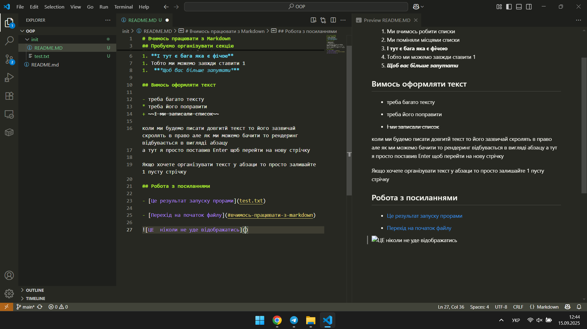

# Вчимось працювати з Markdown

## Пробуємо організувати секцію
1. Ми вчимось робити списки
1. Ми поміняли місцями списки
1. **І тут є бага яка є фічою**
1. Тобто ми можемо завжди ставити 1
1.  ***Щоб вас більше запутати***

## Вимось оформляти текст

- треба багато тексту
* треба його поправити
+ ~~І ми записали список~~

коли ми будемо писати довгитй текст то його зазвичай скролять в право але як ми можемо бачити то рендеринг відбувається в вигляді абзацу
а тут я просто поставив Enter щоб перейти на нову стрічку

Якщо хочете організувати текст у абзаци то просто залишайте 1 пусту стрічку

## Робота з посиланнями

- [Це результат запуску прорами](test.txt)

- [Перехід на початок файлу](#вчимось-працювати-з-markdown)




[WARNING]

## Виділення коду
Якщо ми просто виділяємо код просто вставлений код то `code test`

``` Java
    System.out.println("Hello world");
    for(int x = ; x <= 0; x++){
        
    }
```
