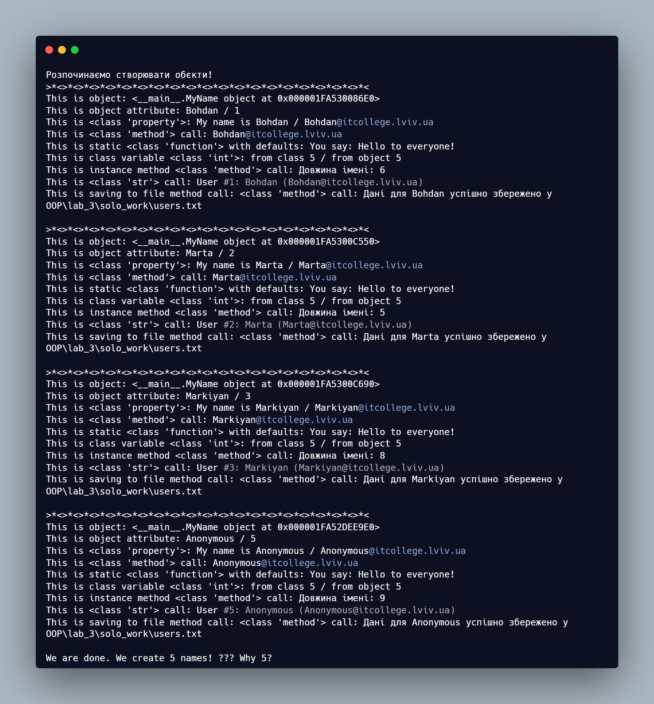
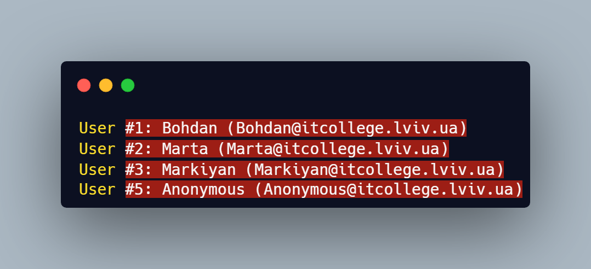

# Звіт до роботи
## Тема: _Знайомство з ООП_
### Мета роботи: _Навчитись використовувати основні принципи ООП, розглянути конструкції побудови класу та створення об'єктів та навчитись працювати з ними_

---
### Виконання роботи
* Результати виконання завдання *1...N*;
    1. Створили два python файли: `.ipynb` та `.py`.
    
    1. Програма вивела значення:
    
    
    1. Перевірка запису у файл `users.txt`:
    

    1. **Відповіді на контрольні запитання:**
        * **Чому коли передаємо значення `None` створюється об'єкт з іменем `Anonymous`?**
          Це реалізовано через логіку в конструкторі `__init__`. Якщо аргумент `name` не передано (тобто він дорівнює `None`), спрацьовує умова `else`, яка викликає метод класу `anonymous_user()`. Цей метод повертає новий екземпляр класу зі стандартним іменем "Anonymous".

        * **Як змінити текст привітання при виклику методу `say_hello`?**
          Метод `say_hello` є статичним (`@staticmethod`), тому він не прикріплений до конкретного об'єкта. Щоб змінити текст, ми передаємо рядок як аргумент при виклику: `MyName.say_hello("Привіт, викладачу!")`.

        * **Чому маємо різну кількість імен (Total names)?**
          Було виявлено, що `total_names` дорівнює 5, хоча у списку було лише 4 елементи (`Bohdan`, `Marta`, `markiyan`, `None`). Це сталося тому, що при обробці `None` створюється додатковий *тимчасовий* екземпляр класу через виклик `anonymous_user()`. Цей тимчасовий об'єкт інкрементує лічильник (+1) перед тим, як це робить основний конструктор (+1). Тобто створення одного "Аноніма" збільшує глобальний лічильник двічі.

    1. **Навчились:**
        - Працювати зі **змінними класу** (`total_names`), які зберігають спільний стан для всіх об'єктів (глобальний лічильник).
        - Використовувати **змінні екземпляра** (`self.name`) для зберігання унікальних даних конкретного об'єкта.
        - Розуміти різницю між методами екземпляра, статичними методами (`@staticmethod`) та методами класу (`@classmethod`).
        - Аналізувати поведінку конструктора `__init__`: виклики метод